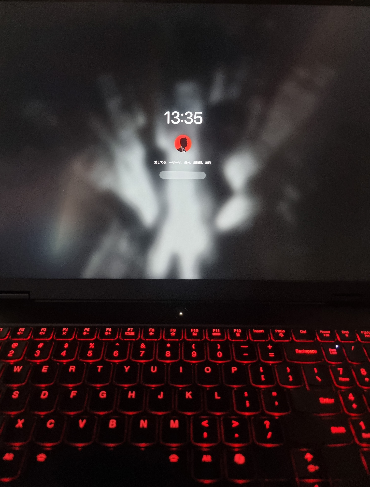

# Hyprlock-Style SDDM Theme

A beautiful dark SDDM theme inspired by Hyprlock, featuring Japanese text, murder-red accents, and a sleek modern design.



## 🎨 Features

- **Live Clock** - Real-time clock display in HH:mm:ss format
- **Circular Avatar** - Clean circular user avatar with border
- **Smooth Animations** - Password field animations and hover effects
- **Power Controls** - Minimalist power off and reboot buttons
- **Hyprlock-Inspired** - Matching the popular Hyprlock screen locker aesthetic
- **Japanese Welcome Text** - "愛してる、一秒一秒、毎分、毎時間、毎日" (I love you, every second, every minute, every hour, every day)
- **Blurred Background** - Beautiful blur effects on background image


## 📦 What's Included

The theme comes with default images to get you started:
- **Background**: Dark city aerial view (`assets/background.jpg`) - A moody cityscape
- **Avatar**: Shadow profile image (`assets/avatar.jpg`) - Default user avatar

## 🚀 Quick Installation

1. **Clone this repository:**
   ```bash
   git clone https://github.com/uzski/custom-sddm-theme.git
   cd custom-sddm-theme
   ```

2. **Run the installer:**
   ```bash
   sudo ./install.sh
   ```

3. **Follow the prompts to:**
   - Install the theme
   - Test it in preview mode
   - Enable SDDM as your display manager

That's it! The theme is ready to use with the included images.

## 🎨 Customization Guide

### Change the Background Image

The theme includes a dark city aerial view by default. To use your own:

```bash
# Copy your image to the assets folder
cp /path/to/your/wallpaper.jpg assets/background.jpg

# If already installed, update the theme
sudo cp assets/background.jpg /usr/share/sddm/themes/hyprlock-style/assets/
```

**Tips:**
- Recommended resolution: 1920x1080 or higher
- Dark images work best with the theme's color scheme
- The theme automatically applies blur and color overlays

### Change the Avatar Image

The theme includes a default avatar. To use your own:

```bash
# Copy your avatar to the assets folder
cp /path/to/your/avatar.jpg assets/avatar.jpg

# If already installed, update the theme
sudo cp assets/avatar.jpg /usr/share/sddm/themes/hyprlock-style/assets/
```

**Tips:**
- Any size works (will be cropped to circle)
- Square images work best
- High contrast images look great with the dark theme

### Customize Colors

Edit `Main.qml` to change the color scheme:

```qml
// Core color scheme (lines 13-15)
readonly property color murderColor: "#a31621"  // Main accent (red)
readonly property color accentColor: "#FCF7F8"  // Text/borders (white)
readonly property color bgDarkColor: "#121212"  // Dark backgrounds
```

Popular color combinations:
- **Cyberpunk**: `murderColor: "#00ffff"`, `accentColor: "#ff00ff"`
- **Forest**: `murderColor: "#2d5016"`, `accentColor: "#a4c2a8"`
- **Ocean**: `murderColor: "#006994"`, `accentColor: "#b8dbd9"`
- **Sunset**: `murderColor: "#ff6b35"`, `accentColor: "#f7931e"`

### Change the Welcome Text

Edit line 69 in `Main.qml`:

```qml
text: "愛してる、一秒一秒、毎分、毎時間、毎日"
```

Some alternatives:
- English: `text: "Welcome back"`
- Motivational: `text: "今日も頑張ろう"` (Let's do our best today)
- Minimal: `text: ""` (no text)
- Custom: `text: "Your message here"`

### Change the Font

Edit line 16 in `Main.qml`:

```qml
readonly property string fontFamily: "Maple Mono NF"
```

Good monospace fonts for this theme:
- `"JetBrains Mono"`
- `"Fira Code"`
- `"Source Code Pro"`
- `"Cascadia Code"`

### Advanced Customization

#### Blur Effect
Adjust blur intensity in `Main.qml` (line 41-42):
```qml
radius: 12  // Increase for more blur
samples: 32 // Increase for smoother blur
```

#### Password Field Size
Edit `Main.qml` (line 179-180):
```qml
width: 300  // Make wider/narrower
height: 50  // Make taller/shorter
```

#### Clock Format
Change time format in `Main.qml` (line 95 & 296):
```qml
text: Qt.formatTime(new Date(), "HH:mm:ss")  // 24-hour
text: Qt.formatTime(new Date(), "hh:mm AP")  // 12-hour with AM/PM
```

## 🔧 Testing Your Changes

Test the theme without logging out:

```bash
# Test directly from your development folder
sddm-greeter --test-mode --theme .

# Or test installed version
sddm-greeter --test-mode --theme /usr/share/sddm/themes/hyprlock-style
```

Press `Ctrl+C` to exit test mode.

## 📁 File Structure

```
custom-sddm-theme/
├── assets/
│   ├── background.jpg    # Background image (dark city)
│   └── avatar.jpg        # User avatar (shadow profile)
├── Main.qml              # Main theme file
├── theme.conf            # Configuration
├── metadata.desktop      # Theme metadata
├── install.sh            # Installation script
└── README.md             # This file
```

## 🛠️ Troubleshooting

### Theme not appearing
```bash
# Check if SDDM is using the theme
cat /etc/sddm.conf.d/theme.conf

# Should show:
# [Theme]
# Current=hyprlock-style
```

### Images not showing
- Ensure images are in `assets/` folder
- Check file permissions: `ls -la /usr/share/sddm/themes/hyprlock-style/assets/`
- Images should be readable: `chmod 644 assets/*`

### Testing fails
- Install required packages:
  ```bash
  # Arch Linux
  sudo pacman -S sddm qt5-quickcontrols2 qt5-graphicaleffects
  
  # Ubuntu/Debian
  sudo apt install sddm qml-module-qtquick-controls2 qml-module-qtgraphicaleffects
  ```

## 📦 Requirements

- SDDM
- Qt 5.15+
- QtQuick Controls 2
- QtGraphicalEffects

## 📄 License

MIT License - Feel free to modify and share!

## 👤 Author

Created by **uzski**

## 🤝 Contributing

Contributions are welcome! Feel free to:
- Fork and create your own version
- Submit pull requests with improvements
- Share your custom color schemes
- Report issues

## 🙏 Credits

- Inspired by Hyprlock's aesthetic
- Dark city background and shadow avatar included as starter images
- SDDM and Qt/QML teams for the framework

---

**Enjoy your new login screen! 🎉**
